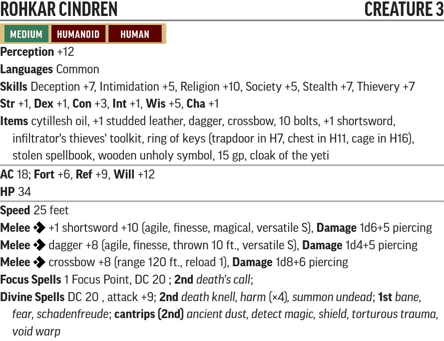
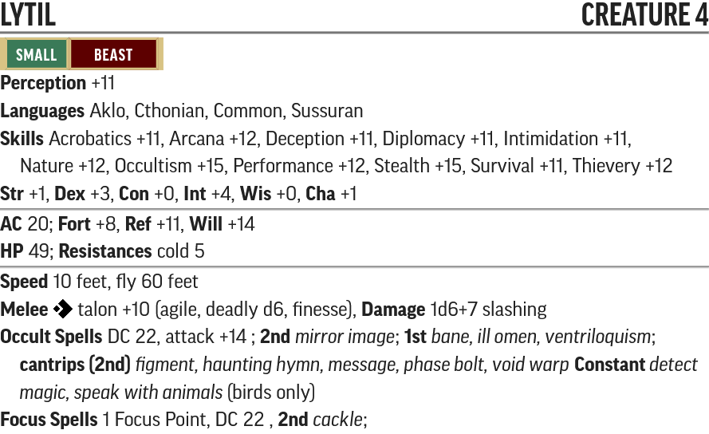
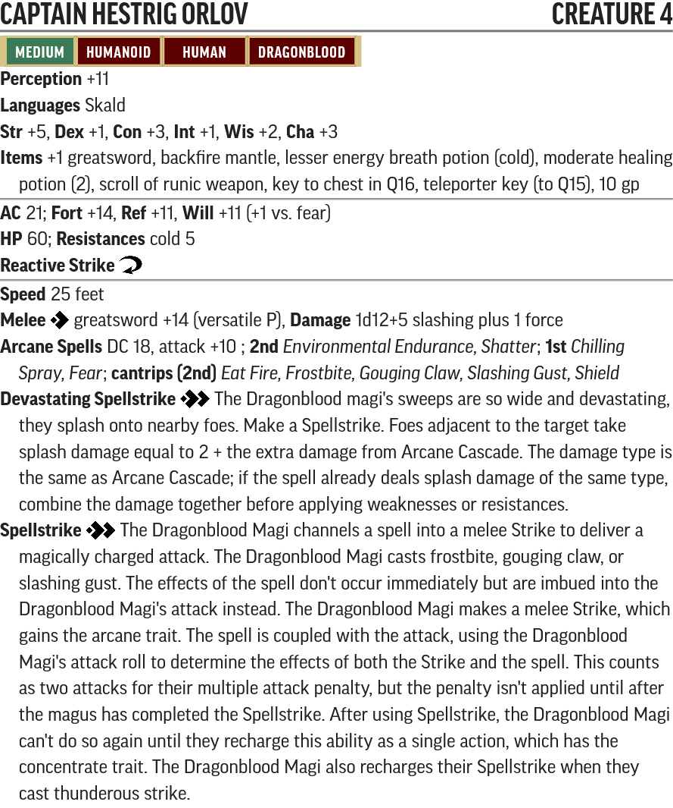
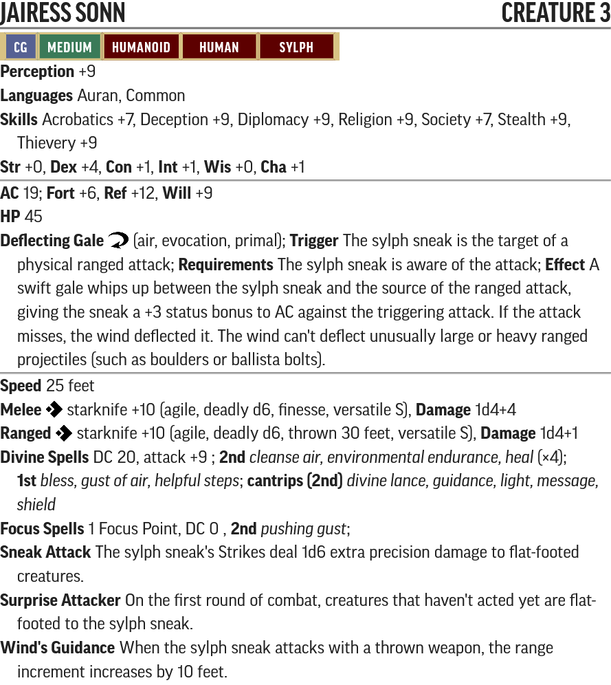
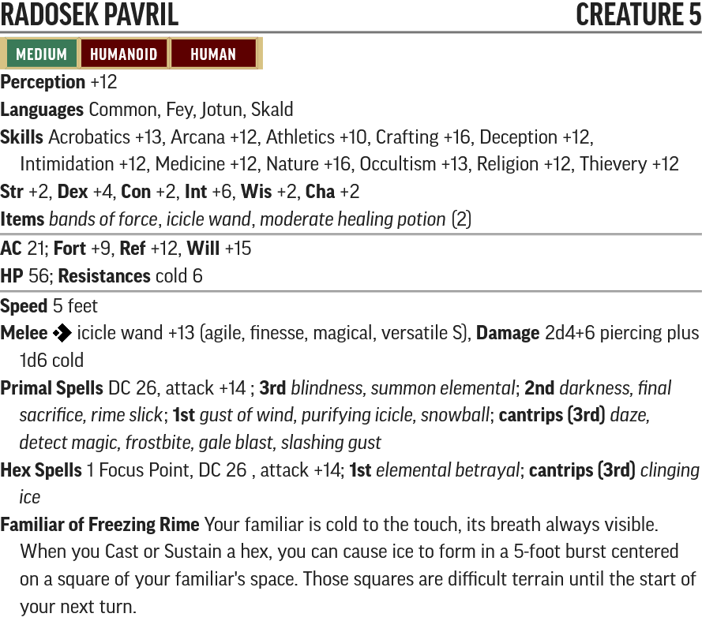
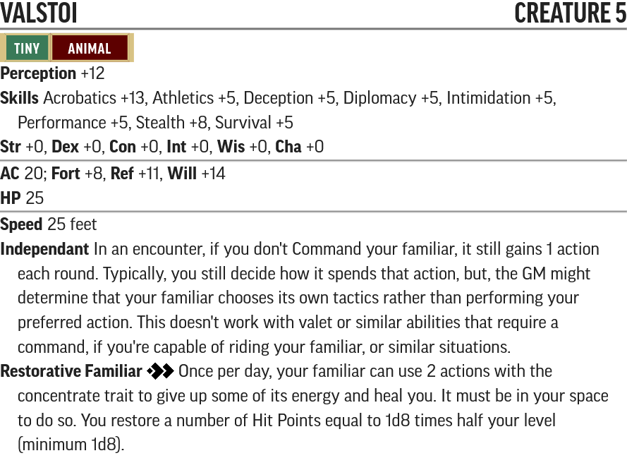
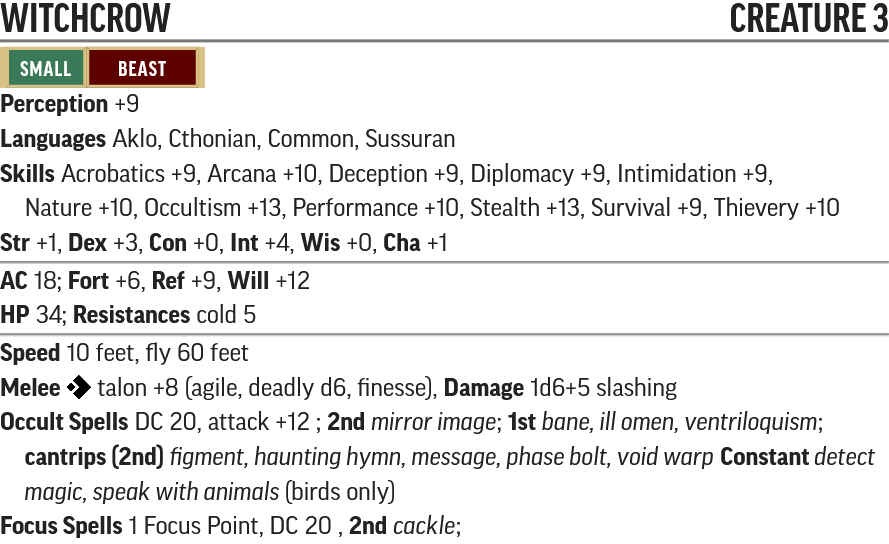

# The Snows of Summer - Creature Statblocks

Any listed items with a carat (^) at the end is a item that does not exist in the current Pathfinder 2e SRD. These items will be linked below their statblock.

Use the PF2 Tools JSON files with [https://monster.pf2.tools/]. Be aware these do **NOT** import directly into FoundryVTT.

## Named NPCs

### Rohkar Cindren

* [PF2 Tools JSON](PF2Tools/RohkarCindren.json)
* [PDF](PDFs/RohkarCindren.pdf)

Rohkar is built as a Level 3 Cleric with the Death Domain.

#### Rohkar's Items

* [Cloak of the Yeti](Items/README.md#cloak-of-the-yeti)
* [Scroll](https://2e.aonprd.com/Equipment.aspx?ID=2962) of [Summon Undead](https://2e.aonprd.com/Spells.aspx?ID=1706)
* [Cytillesh Oil](https://2e.aonprd.com/Equipment.aspx?ID=3330)
* [+1](https://2e.aonprd.com/Equipment.aspx?ID=2785) [Studded Leather Armor](https://2e.aonprd.com/Armor.aspx?ID=42)
* [Crossbow](https://2e.aonprd.com/Weapons.aspx?ID=425)
* 10x [Bolts](https://2e.aonprd.com/Weapons.aspx?ID=441)
* [Infiltrator's Thieves' Toolkit](https://2e.aonprd.com/Equipment.aspx?ID=2758)
* ring of keys (trapdoor in H7, chest in H11, cage in H16)
* stolen spellbook containing:
  - [Bullhorn](https://2e.aonprd.com/Spells.aspx?ID=1971)
  - [Illuminate](https://2e.aonprd.com/Spells.aspx?ID=1359)
  - [Message](https://2e.aonprd.com/Spells.aspx?ID=1598)
  - [Phase Bolt](https://2e.aonprd.com/Spells.aspx?ID=2576)
  - [Dizzying Colors](https://2e.aonprd.com/Spells.aspx?ID=1500)
  - [Force Barrage](https://2e.aonprd.com/Spells.aspx?ID=1536))
* [Wooden Religious Symbol](https://2e.aonprd.com/Equipment.aspx?ID=2745)
* 15 gp

### Lytil

* [PF2 Tools JSON](PF2Tools/Lytil.json)
* [PDF](PDFs/Lytil.pdf)

Lytil just a Witchcrow with the Elite adjustment.

### Captain Hestrig Orlov

* [PF2 Tools JSON](PF2Tools/CaptainHestrigOrlov.json)
* [PDF](PDFs/CaptainHestrigOrlov.pdf)

Hestrig is built as a Dragonblood Magus with the Rime Dragon Benefactor.

#### Hestrig's Items

* [+1](https://2e.aonprd.com/Equipment.aspx?ID=2830) [Greatsword](https://2e.aonprd.com/Weapons.aspx?ID=379)
* [Backfire Mantle](https://2e.aonprd.com/Equipment.aspx?ID=1040)
* [Lesser Energy Breath Potion (Cold)](https://2e.aonprd.com/Equipment.aspx?ID=2941)
* 2x [Moderate Healing Potions](https://2e.aonprd.com/Equipment.aspx?ID=2943)
* [Scroll](https://2e.aonprd.com/Equipment.aspx?ID=2962) of [Runic Weapon](https://2e.aonprd.com/Spells.aspx?ID=1658)
* Key to Chest in Q16
* Key to Ice Crystal Teleporter in Q15
* 10 gp

### Jairess Sonn

* [PF2 Tools JSON](PF2Tools/JairessSonn.json)
* [PDF](PDFs/JairessSonn.pdf)

Jairess is built as a Sylph Cleric with an emphasis on wind-related spells.

### Radosek Pavril

* [PF2 Tools JSON](PF2Tools/RadosekPavril.json)
* [PDF](PDFs/RadosekPavril.pdf)

Radosek is built as a Level 5 Witch with the Silence in Snow patron.

#### Radosek's Items

* [Icicle Wand](Items/README.md#icicle-wand)
* [Bands of Force](https://2e.aonprd.com/Equipment.aspx?ID=3058)
* 2x [Moderate Healing Potion](https://2e.aonprd.com/Equipment.aspx?ID=2943)

### Valstoi

* [PF2 Tools JSON](PF2Tools/Valstoi.json)
* [PDF](PDFs/Valstoi.pdf)

Valstoi is built as a goat familiar.

## New Creatures

### Witchcrow

* [PF2 Tools JSON](PF2Tools/Witchcrow.json)
* [PDF](PDFs/Witchcrow.pdf)

### Animated Ice Dragon

* [PF2 Tools JSON](PF2Tools/AnimatedIceDragon.json)
* [PDF](PDFs/AnimatedIceDragon.pdf)

### Animated Ice Nymph

* [PF2 Tools JSON](PF2Tools/AnimatedIceNymph.json)
* [PDF](PDFs/AnimatedIceNymph.pdf)
