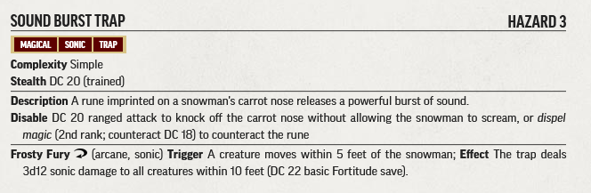
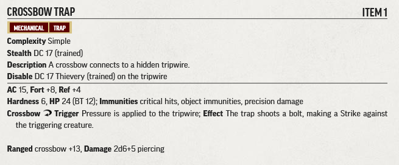
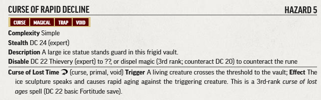

# Hazard Statblocks

Use the PF2 Tools JSON files with [https://template.pf2.tools/]. Be aware these do **NOT** import directly into FoundryVTT.

## F1. Trail Sign

### Sound Burst Trap

* [PDF](SoundBurstTrap.pdf)

## F2. Wishbone Creek

### Frozen Creek

* [PDF](FrozenCreek.pdf)

## H1. Eastern Trailhead

### Crossbow Trap

* [PDF](CrossbowTrap.pdf)

## H4. Bridge

### Icy Bridge

* [PDF](IcyBridge.pdf)

## Q24. Vault

### Curse of Rapid Decline

* [PDF](CurseOfRapidDecline.pdf)
