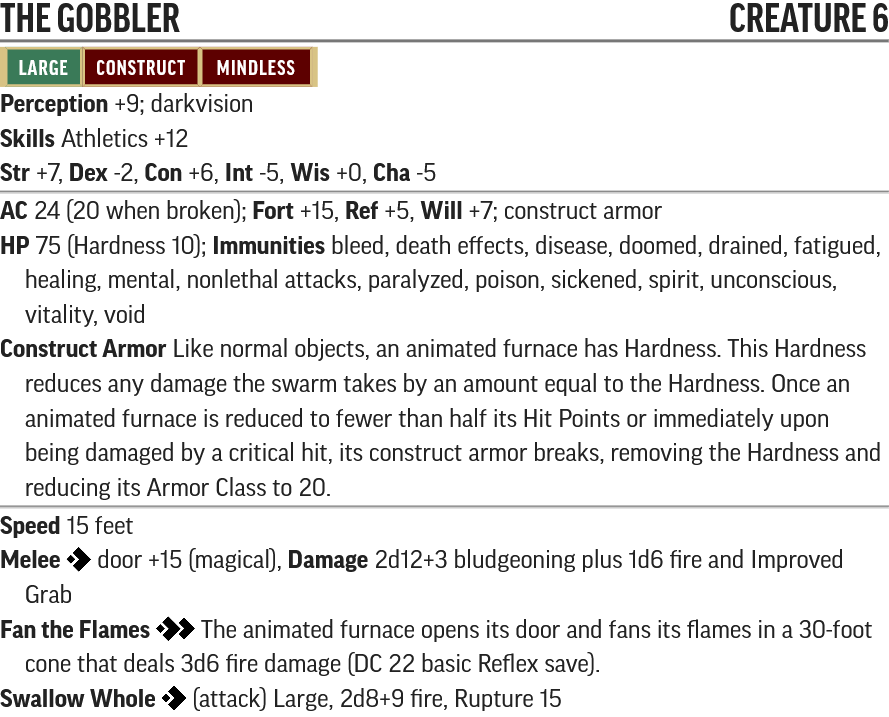
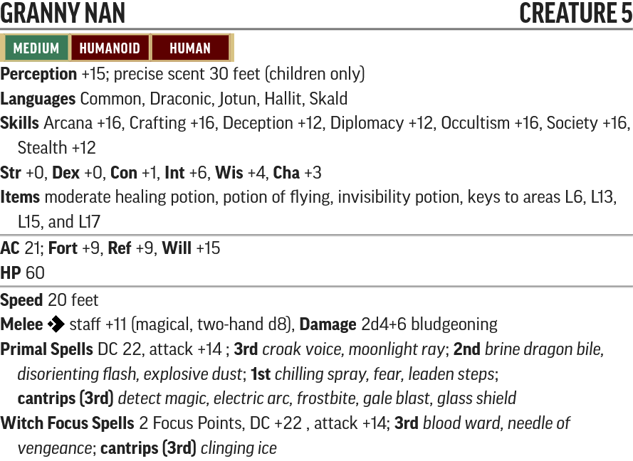
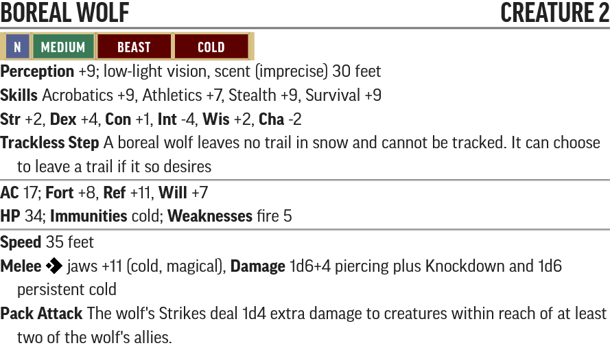
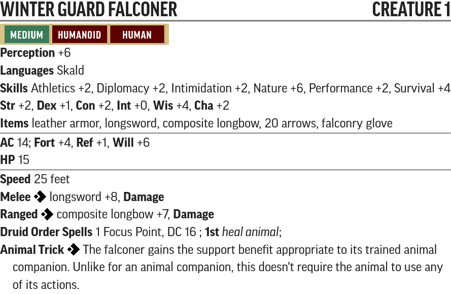
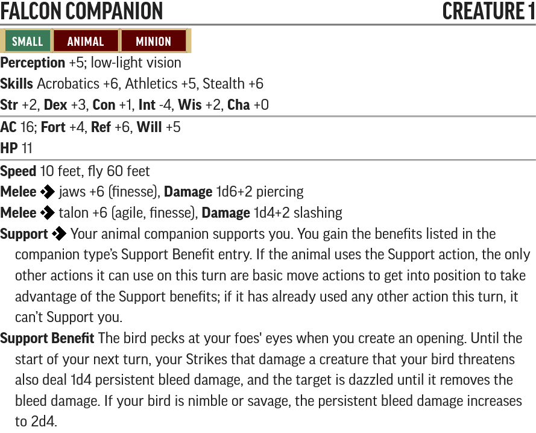
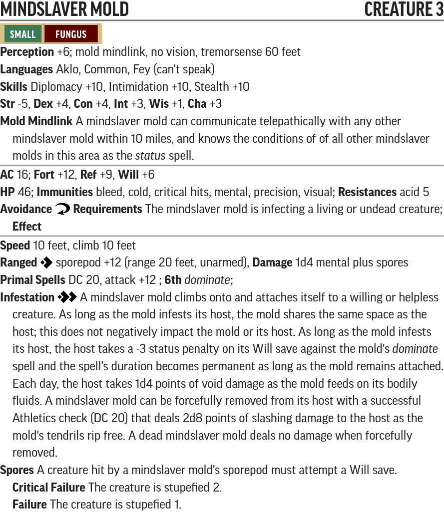
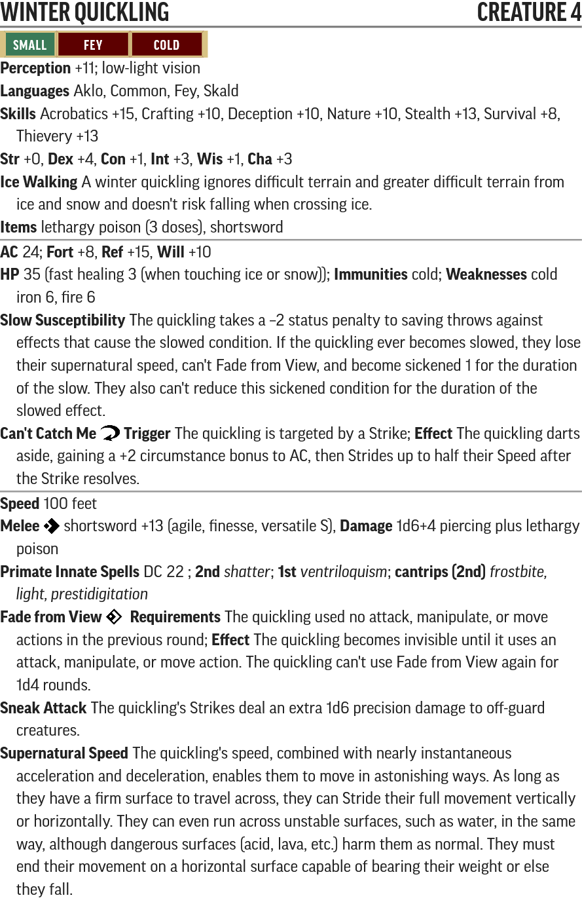
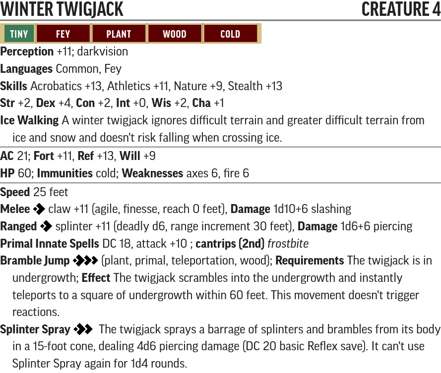
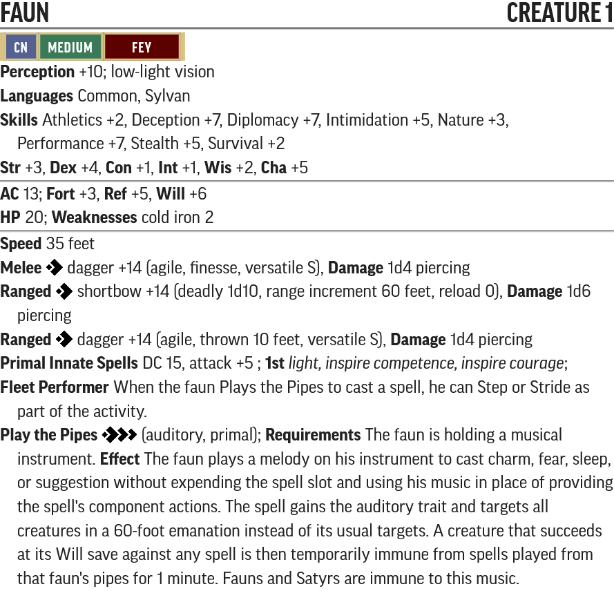
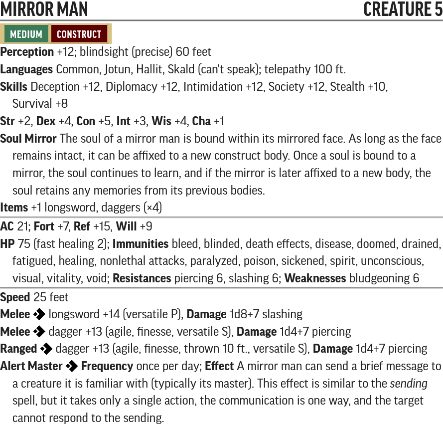

# The Shackled Hut - Creature Statblocks

Any listed items with a carat (^) at the end is a item that does not exist in the current Pathfinder 2e SRD. These items will be linked below their statblock.

Use the PF2 Tools JSON files with [https://monster.pf2.tools/]. Be aware these do **NOT** import directly into FoundryVTT.

## Named NPCs

### The Gobbler

* [PF2 Tools JSON](PF2Tools/TheGobbler.json)
* [PDF](PDFs/TheGobbler.pdf)

### Granny Nan

* [PF2 Tools JSON](PF2Tools/GrannyNan.json)
* [PDF](PDFs/GrannyNan.pdf)

## New Creatures

### Boreal Wolf

* [PF2 Tools JSON](PF2Tools/BorealWolf.json)
* [PDF](PDFs/BorealWolf.pdf)

### Winter Guard Falconer

* [PF2 Tools JSON](PF2Tools/WinterGuardFalconer.json)
* [PDF](PDFs/WinterGuardFalconer.pdf)

### Falcon Companion

* [PF2 Tools JSON](PF2Tools/FalconCompanion.json)
* [PDF](PDFs/FalconCompanion.pdf)

### Mindslaver Mold

* [PF2 Tools JSON](PF2Tools/MindslaverMold.json)
* [PDF](PDFs/MindslaverMold.pdf)

### Winter Quickling

* [PF2 Tools JSON](PF2Tools/WinterQuickling.json)
* [PDF](PDFs/WinterQuickling.pdf)

### Winter Twigjack

* [PF2 Tools JSON](PF2Tools/WinterTwigjack.json)
* [PDF](PDFs/WinterTwigjack.pdf)

### Faun

* [PF2 Tools JSON](PF2Tools/Faun.json)
* [PDF](PDFs/Faun.pdf)

### Mirrow Man

* [PF2 Tools JSON](PF2Tools/MirrorMan.json)
* [PDF](PDFs/MirrorMan.pdf)

