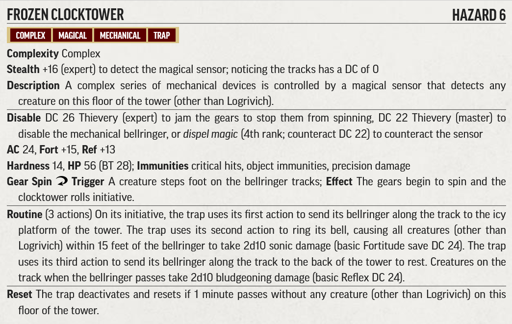

# Hazard Statblocks

Use the PF2 Tools JSON files with [https://template.pf2.tools/]. Be aware these do **NOT** import directly into FoundryVTT.

## C. Haunted Village

### The Children of Ulsgaard

* [PDF](TheChildrenOfUlsgaard.pdf)

### Frozen Clocktower

* [PDF](FrozenClocktower.pdf)

### Font of Water

### Falling Tree Trap

* [PDF](FallingTreeTrap.pdf)

### Tottering Treehouse

### Altar of Earth

### Flaming Font

### The Sky Tree

### The Dancing Hut
